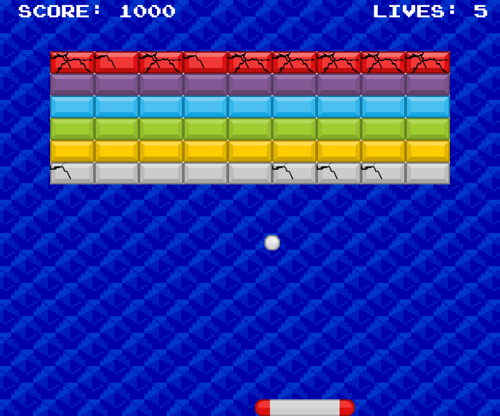

# Arkanoid-rust

Arkanoid game in Rust using Amethyst game engine.

You must use the `--recursive` or `--recurse-submodules` flag when cloning the repository to initialize submodules.

## Screenshot

